# ノート見本作成ツール PRO の使い方

黒板に書く板書計画や、子どもに配るノートの見本を、マス目に合わせた形で作って印刷できる Web アプリです。文章を打ちこむと、国語や算数のノートのマス目に 1 文字ずつ割り付けられ、そのまま A4 で刷れます。ここでは、初めて開いた先生が、この画面だけで印刷までたどり着けるように、全部の機能を順に説明します。

## はじめに（このツールでできることと、使う前の準備）

このアプリが何をするものかと、読みはじめる前に手元にそろえておくものを説明します。ここだけは、飛ばさずに読んでください。

### 「ノート見本作成ツール PRO」とは

先生が打った文章を、ノートのマス目にそろえて割り付け、印刷できる形にするアプリです。国語の 15 マス、算数の 17 マス、原稿用紙といった用紙のかたちをあらかじめ持っていて、そこに文章を流しこみます。

決まった記号を文章の中に打つと、めあての丸や、赤い線や、穴埋めの空欄が付きます。刷ったものは、そのまま黒板の横に貼る見本にも、子どもに配るプリントにも使えます。

使うのは先生だけです。子どもがこのアプリを開いて操作することは想定していません。

無償で公開しています。アカウントの登録も、申しこみもいりません。どの学校でも自由に使えますし、校内での配布や、刷ったものを保護者に渡すことにも制限はありません。

作ったものの権利は、作った先生のものです。このアプリの側は、打った文章も作った見本も受け取りません。

### 使う前に用意していただくもの

次の 3 つがあれば始められます。インストールや、アカウントの登録はいりません。

1. インターネットにつながるパソコン、またはタブレット。Chrome、Edge、Safari のいずれかで開いてください。
2. 開くアドレス。https://notebooksample-generator.giga-school.com/ です。
3. 印刷するなら、A4 の用紙が入ったプリンタ。画面で見るだけ、PDF にするだけなら、プリンタはいりません。

Google のアカウントは、原則としていりません。複数の端末で保存したノートをそろえたいときにだけ使います（「別の端末でも同じ見本を使う」の章）。

### 最初に開いたときに出るもの

開くと、見本の文章がすでに入った状態で立ち上がります。これは操作を試すためのもので、消して自分の文章に打ちかえてかまいません。

いったん閉じても、次に開いたときには前回の続きが出ます。設定と文章は、そのパソコンの中に自動で覚えられているためです。

## 画面の見かた（左の設定欄と右のプレビュー）

画面は左右に分かれています。左が設定を変えるところ、右がその結果を映すところです。まずどこに何があるかを見ておくと、あとの章が読みやすくなります。

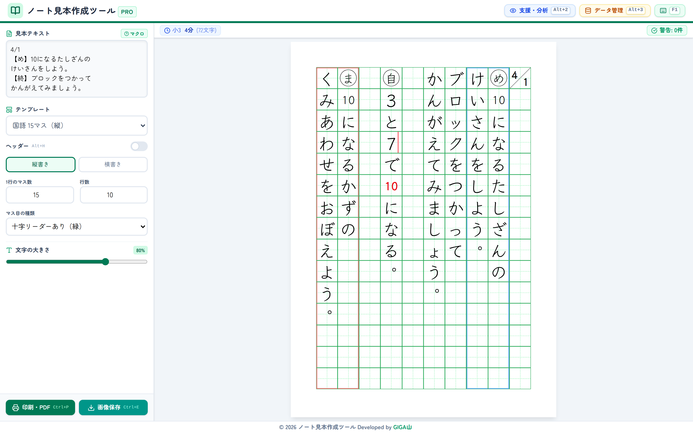

左が設定欄、右がプレビューです。

### 左側の設定欄でできること

上から順に、見本テキストの入力欄、テンプレート、ヘッダーの切り替え、縦書きと横書き、1 行のマス数と行数、マス目の種類、文字の大きさが並びます。いちばん下に、印刷と画像保存のボタンがあります。

ここを変えると、右のプレビューがその場で変わります。決定ボタンのようなものはありません。

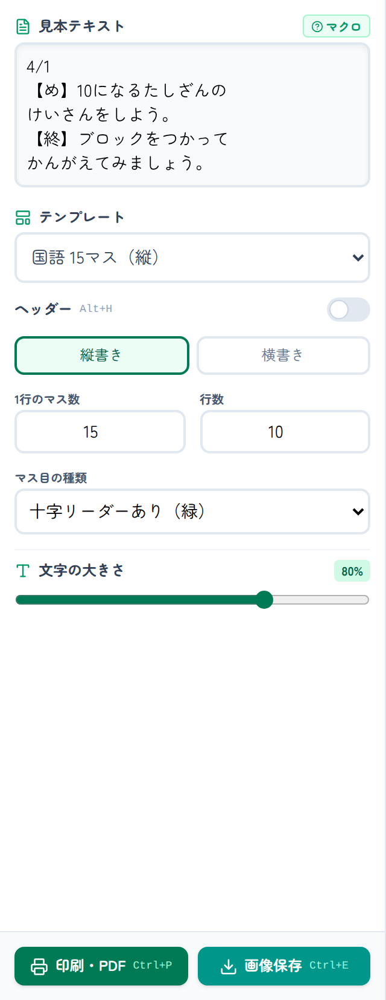

上から順に、文章、用紙、レイアウトの設定です。

### 画面の上に並ぶボタンと、2 つの数

画面の右上には、押すと別の画面が開くボタンが 3 つ並んでいます。左から「支援・分析」「データ管理」、そしてキーボードの絵のボタン（ショートカットの一覧）です。それぞれの中身は、あとの章で説明します。

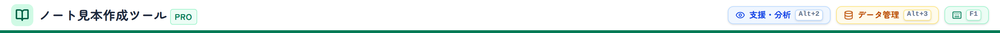

右上に「支援・分析」「データ管理」が並びます。

プレビューの上には、左に「小 3　4 分（72 文字）」のような数、右に「警告: 0 件」と出ています。左は、その学年の子が書き写すのにかかるおよその時間、右は、行のおわりで語が切れていないかを数えたものです。どちらもあとの章で詳しく説明します。

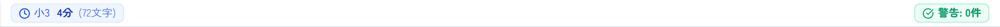

左が書き写す時間、右が警告の数です。

### 印刷と画像保存のボタン

左の設定欄のいちばん下に、緑の「印刷・PDF」と、青緑の「画像保存」があります。作った見本を紙にするか、画像のファイルにするかの違いです。

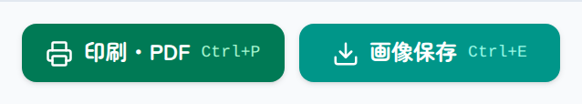

左が印刷、右が画像（PNG）での保存です。

## 見本を 1 枚つくって印刷するまで（最短の流れ）

いちばん短い道すじです。細かい設定は、この章のあとで 1 つずつ説明します。まずはここだけで 1 枚できます。

基本的な流れ:

1. 見本にしたい文章を、左上の入力欄に打つ。
2. 右のプレビューで、マス目に収まっているか確かめる。
3. 左下の「印刷・PDF」を押す。

### 見本にしたい文章を打ちこむ

左上の「見本テキスト」の枠をクリックして、ノートに書かせたい文章を打ってください。改行すると、見本の中でも行が変わります。

最初から入っている文章は、消してかまいません。全部を選んでから消すか、後ろから消してください。

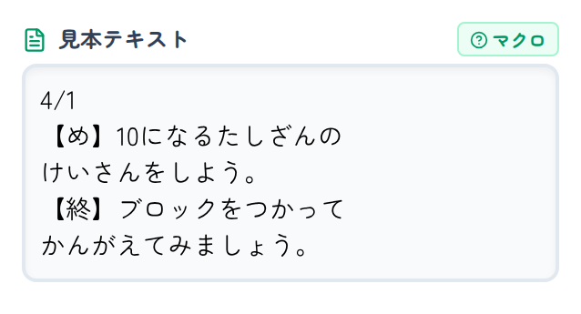

ここに打った文章が、そのまま見本になります。

### できあがりをプレビューで確かめる

打っているそばから、右の白い紙に文字が並びます。これが刷り上がりそのものです。紙のたてとよこ、マスの大きさ、文字の位置は、すべてここで確かめられます。

文字がマスからあふれていないか、最後の行が切れていないかを、ここで見てください。

これが、そのまま刷り上がりになります。

### 印刷・PDF を押す

左下の「印刷・PDF」を押すと、お使いのブラウザの印刷画面が開きます。プリンタを選んで印刷すれば紙になり、送り先に「PDF に保存」を選べばファイルになります。キーボードの Ctrl と P を同時に押しても同じです。

【！】覚えておいていただきたいこと:

- 印刷すると、プレビューに出ている全部のページが刷られます。1 ページ目だけを刷ることはできません。
- 刷ったのにマスの線や色が出ないときは、印刷画面の設定が原因です。「うまくいかないときの対処」の章を見てください。
- 紙のたてとよこは、選んだテンプレートから自動で決まります。印刷画面で選び直す必要はありません。

## 用紙のテンプレートを選ぶ（国語・算数・原稿用紙）

よく使う用紙のかたちを 5 つ用意しています。左の設定欄の「テンプレート」から選んでください。選ぶと、マス数、行数、書く向き、マス目の種類が一度に切り替わります。

### テンプレートを切り替える

「テンプレート」の欄を押すと、選べるものの一覧が出ます。上から「カスタム設定」「国語 15マス（縦）」「国語 12マス（縦）」「算数 17マス（横）」「算数 22マス（横）」「原稿用紙 400字」の 6 つです。

「カスタム設定」は、自分でマス数などを決めるときのものです。ほかのテンプレートを選んだあとで下の設定をいじると、自動的に「カスタム設定」に切り替わります。

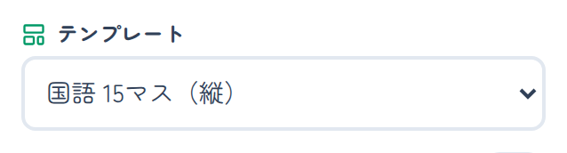

ここを押すと、6 つの中から選べます。

### 国語のノート（15 マス・12 マス）を使う

「国語 15マス（縦）」は 1 行 15 マス、10 行の縦書きで、A4 のたてになります。いちばんよく使う形です。低学年でマスの大きいノートを使っているときは、「国語 12マス（縦）」を選ぶと 1 行 12 マス、8 行になり、1 マスが大きくなります。

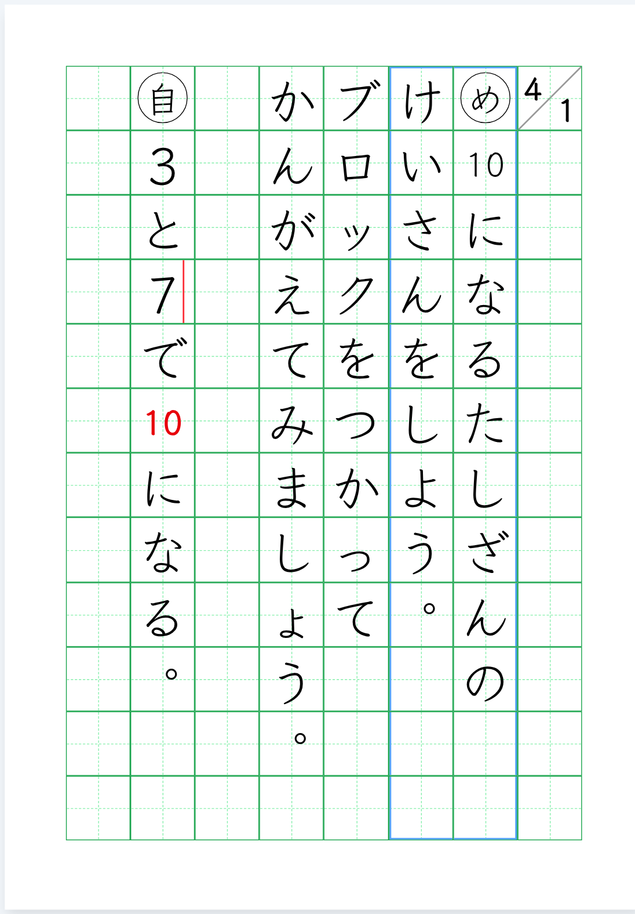

15 マスより 1 マスが大きくなります。

### 算数のノート（17 マス・22 マス）を使う

「算数 17マス（横）」は 1 行 17 マス、12 行の横書きで、A4 のよこになります。マスの細かいノートには「算数 22マス（横）」があり、1 行 22 マス、15 行になります。

2 けた以上の数字は、どのテンプレートでも 1 マスにまとめて入ります。「10」が 1 マスに収まるので、算数の式はノートと同じ形で並びます。

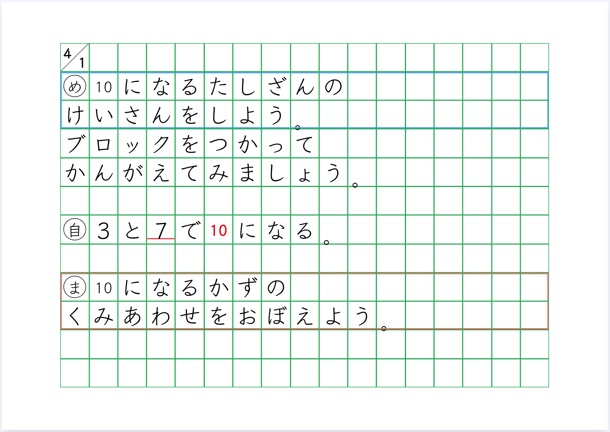

紙は自動で A4 のよこになります。

### 原稿用紙 400 字を使う

「原稿用紙 400字」は、20 マス 20 行の原稿用紙です。題名と名前の欄、まん中の折り目の印まで付いた形で出ます。作文の清書や、書き出しの見本を配るときに使ってください。

【！】覚えておいていただきたいこと:

- 原稿用紙を選んでいるあいだは、マス数、行数、書く向き、マス目の種類、ヘッダーを変えられません。設定欄がうすい灰色になります。
- 変えられるのは「文字の大きさ」だけです。ほかを変えたいときは、別のテンプレートに切り替えてください。
- キーボードの Alt と D、Alt と H も、原稿用紙のあいだははたらきません。

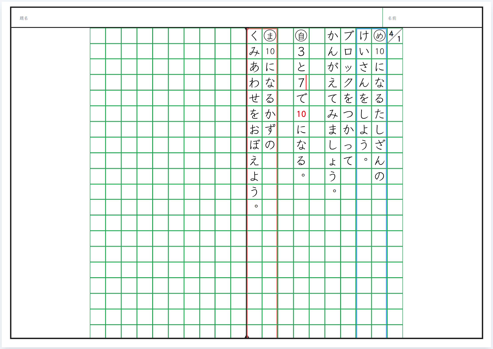

題名と名前の欄が、はじめから付いています。

## マス目のレイアウトを手元のノートに合わせる（カスタム設定）

テンプレートを選んだあと、その下の設定を変えると、手元のノートに合わせられます。1 つでも変えると、テンプレートの表示は「カスタム設定」に変わりますが、見本はそのまま使えます。

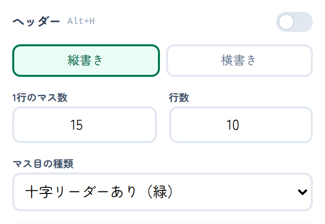

ここでノートに合わせて数を決めます。

### 縦書きと横書きを切り替える

「縦書き」「横書き」のどちらかを押してください。国語は縦書き、算数は横書きが既定です。キーボードの Alt と D を同時に押しても切り替わります。

縦書きでは、文字は右の列から左へ並びます。プレビューで 2 ページ以上になったときも、1 ページ目が右、2 ページ目が左に並びます。

### 1 行のマス数と行数を、ノートの数に合わせる

「1行のマス数」は 5 から 30 まで、「行数」は 3 から 25 まで指定できます。範囲の外の数を入れると、いちばん近い値に直されます。

お使いのノートの 1 行のマスを実際に数えて、同じ数を入れてください。ここが合っていないと、刷った見本とノートで折り返す場所がずれて、子どもが書き写せなくなります。

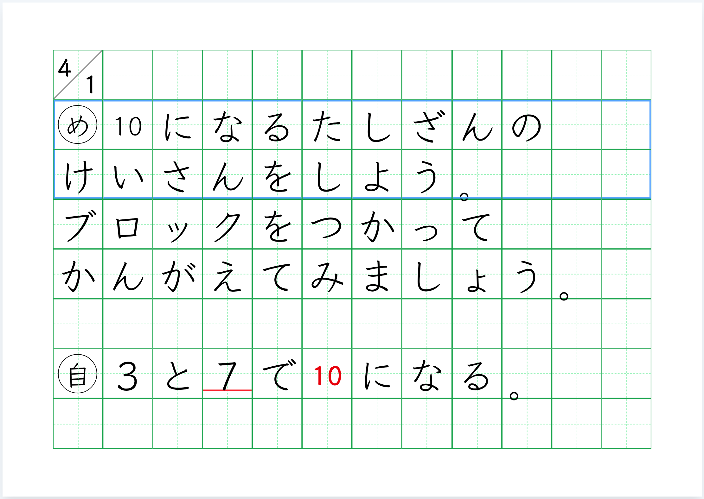

横書きにすると、紙は A4 のよこになります。

### マス目の種類（十字リーダー・マス目のみ・枠線なし）を選ぶ

「マス目の種類」で、マスの見え方を 3 つから選べます。「十字リーダーあり（緑）」はマスの中に薄い十字が入ったもの、「マス目のみ（緑）」は枠だけのもの、「枠線なし（白紙）」は線を引かず文字だけを並べるものです。

低学年の書き取りには十字リーダー、算数の式にはマス目のみ、掲示物にするなら枠線なしが向きます。

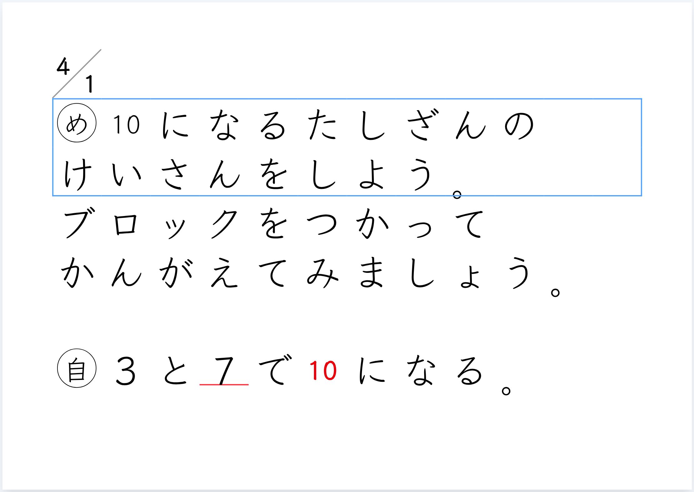

線が消え、文字の位置だけが残ります。

### 月日・題名・なまえの記入欄（ヘッダー）を出す

「ヘッダー」の右にあるつまみを押すと、紙の上に「月」「日」の記入欄、題名を書く線、「なまえ」の欄が出ます。そのまま配るプリントにするときに使ってください。キーボードの Alt と H でも切り替わります。

ヘッダーを出すと、そのぶんマス目の入る高さが減り、1 マスが少し小さくなります。

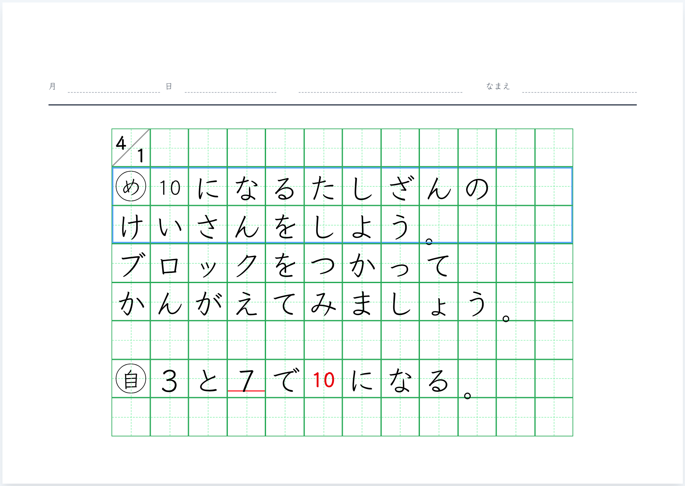

紙の上に、月日と名前の欄が付きます。

### 文字の大きさを変える

いちばん下のつまみを左右に動かすと、マスに対する文字の大きさが 30 パーセントから 100 パーセントまで変わります。既定は 80 パーセントです。

文字がマスからはみ出して見えるときは、ここを小さくしてください。逆に、うすくて見えにくいときは大きくします。

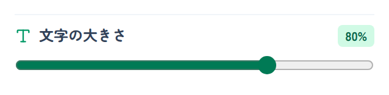

右の数字が、いまの大きさです。

## 見本テキストに記号を打って板書の形にする

文章の中に決まった記号を打つと、めあての丸や、赤い線や、穴埋めの空欄が付きます。記号そのものは印刷されません。記号を覚えなくても次の章のなぞる操作で入れられますが、慣れると打ったほうが速くなります。

### アプリの中にある記号の一覧を開く

「見本テキスト」の右にある「マクロ」を押すと、記号の一覧がその場で開きます。閉じるときは、もう一度「マクロ」を押してください。

ここにまとまっているのは、よく使うものです。一覧に出ていない【も】【問】【じ】【自】も、次の節のとおりに使えます。

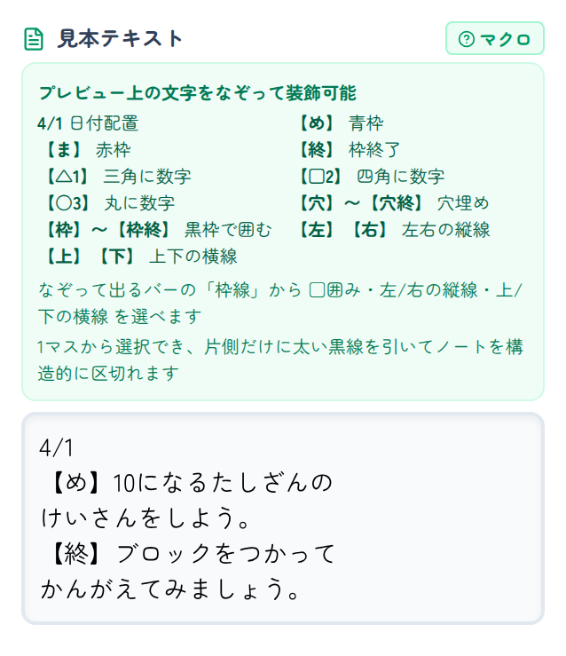

「マクロ」を押すと、その場で開きます。

### めあてとまとめを、丸と枠で示す

行の先頭に次の記号を打つと、丸の中に文字が入り、そこから下が色の枠で囲まれます。

1. 【め】、【も】、【問】…　丸の中にその文字が入り、ここから下が青い枠で囲まれます。めあてや問いに使います。
2. 【ま】…　丸の中に「ま」が入り、ここから下が赤い枠で囲まれます。まとめに使います。
3. 【じ】、【自】…　丸の中にその文字が入り、囲みの枠はここで終わります。自力解決の場面に使います。
4. 【終】…　囲みの枠をここで終わらせます。空の行を 1 つ入れても、同じように終わります。

### 線・文字色・穴埋め・枠で強調する

はさんで使う記号です。始まりの記号と終わりの記号のあいだが、その見た目になります。

1. 【赤字】と【字終】…　はさんだところが赤い字になります。
2. 【赤線】と【線終】…　はさんだところの下（縦書きでは右）に赤い線が引かれます。【青線】と【黒線】も同じ形で使えます。
3. 【穴】と【穴終】…　はさんだところが空欄になり、点線の枠が付きます。書き取りの練習に使います。
4. 【枠】と【枠終】…　はさんだところを太い黒枠で囲みます。
5. 【左】と【左終】…　はさんだところの左側だけに太い黒線を引きます。【右】【上】【下】も同じ形で、その側だけに線を引きます。ノートを区切る補助線に使います。

### 三角・四角・丸の中に数字を入れる、日付のマスを作る

1 マスの中に図形と数字をまとめて入れる記号です。

1. 【△1】、【□2】、【○3】…　三角、四角、丸の中にその文字が入ります。中の文字は数字でなくてもかまいません。
2. 4/1 のように打つ…　ななめ線の入った日付のマスになります。左上に月、右下に日が入ります。
3. 12 のように 2 けた以上の数字を打つ…　1 マスにまとめて入ります。けたが増えるほど、字は自動で小さくなります。

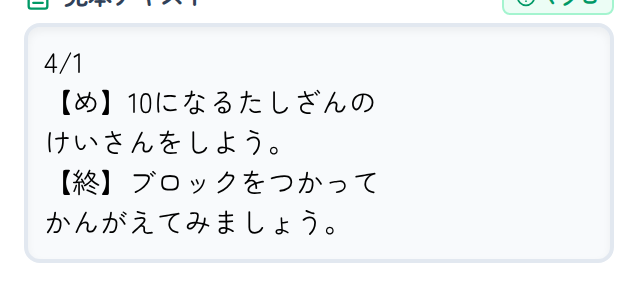

この文章が、次の見本になります。

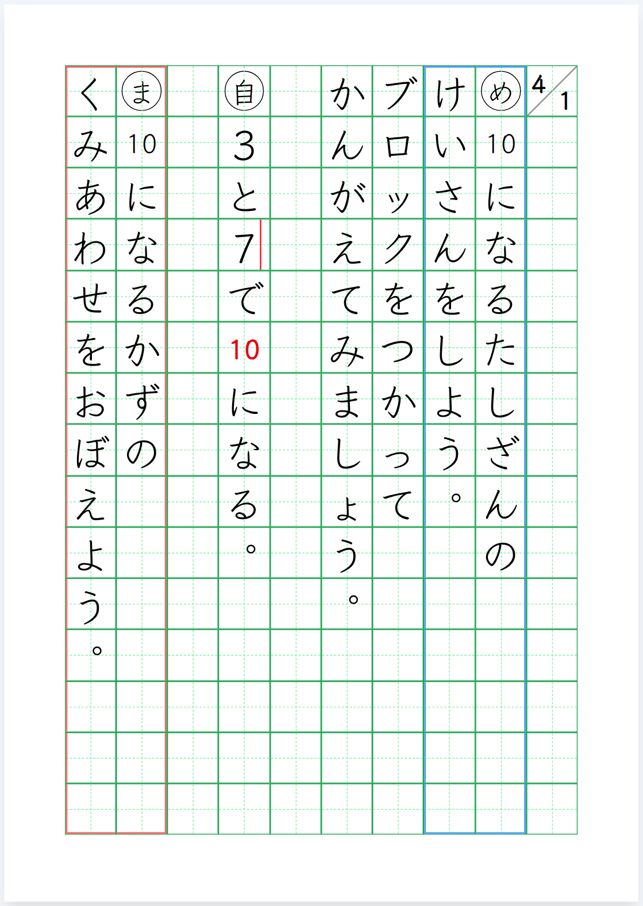

丸、青枠、赤枠、赤線、赤字が付いています。

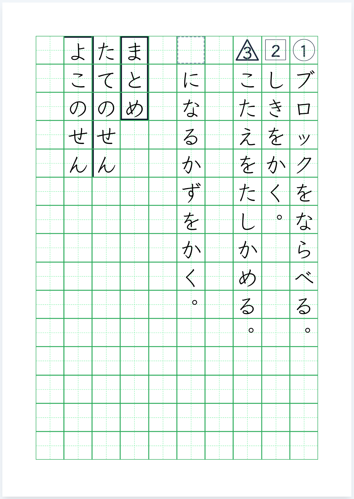

図形、点線の空欄、太い黒枠の例です。

## プレビューをなぞって、記号を打たずに装飾する

記号を覚えていなくても、右のプレビューの上で文字をなぞれば同じことができます。押した結果は、左の入力欄に記号として自動で書きこまれます。

### プレビューの文字をなぞって選ぶ

飾りたい文字の上でマウスの左ボタンを押したまま動かし、終わりのところで指をはなしてください。選んだところが緑色になります。1 マスだけでも選べます。

選ぶのをやめたいときは、紙の外側の灰色のところをクリックしてください。緑色が消えます。

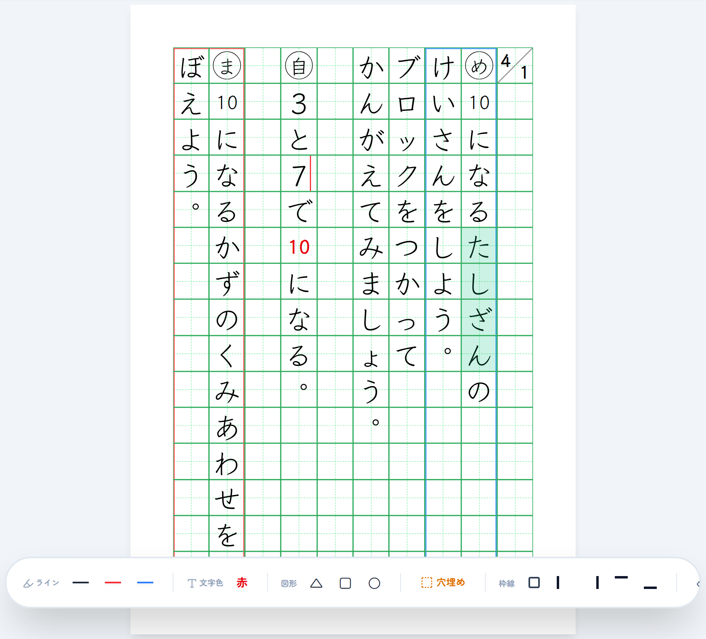

選んだところが緑になり、下にバーが出ます。

### 出てきたバーのボタンを押す

選ぶと、画面の下に横長のバーが出ます。左から順に、ライン（黒・赤・青）、文字色の赤、図形（三角・四角・丸）、穴埋め、枠線（囲み・左・右・上・下）、そしていちばん右にクリアが並びます。

押すと、その場で見本が変わり、左の入力欄にも記号が入ります。狭い画面ではバーの右側が隠れることがあります。そのときは、バーの上を横に動かすと残りのボタンが出ます。

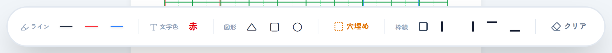

左からライン、文字色、図形、穴埋め、枠線、クリアです。

消したいところをもう一度なぞって選び、バーのいちばん右にある「クリア」を押してください。選んだところの線、色、図形、空欄、枠がまとめて消え、素の文字だけが残ります。

【！】覚えておいていただきたいこと:

- なぞって押した結果は、左の入力欄の文章に記号として残ります。あとから手で直すこともできます。
- 同じところに違う線を引き直すと、前の線は自動で取り除かれます。二重にはなりません。
- 「クリア」で消えるのは、選んだところの装飾だけです。文字そのものは消えません。

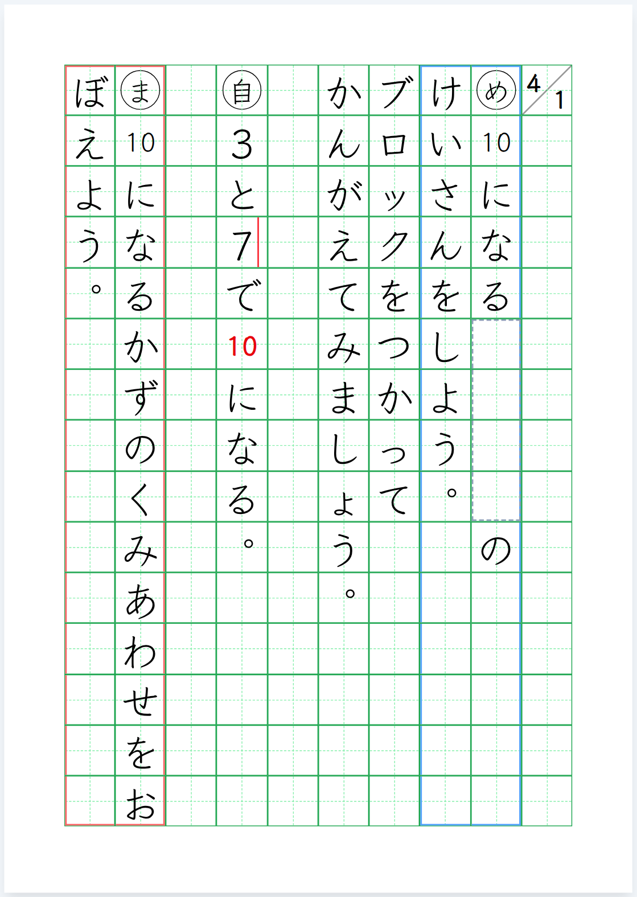

選んだ 4 マスが点線の空欄になりました。

## 子どもに合わせて表示を変え、書く時間を見積もる（支援・分析）

同じ文章から、なぞり書き用の見本や、穴埋めの練習用の見本を作れます。書き写しにかかる時間の目安も、ここで学年を選んで出します。

画面の右上にある「支援・分析」を押すと開きます。キーボードの Alt と 2 でも開きます。閉じるときは、下の「閉じる」か、キーボードの Esc を押してください。

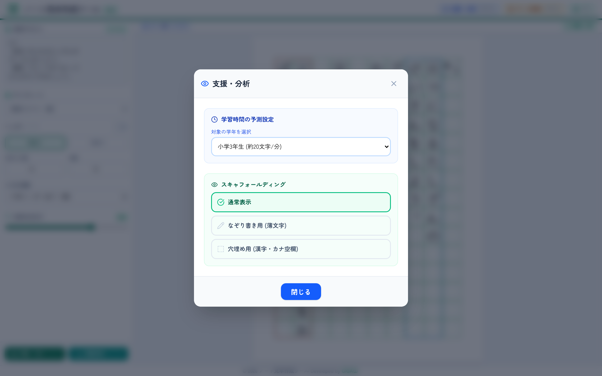

上が学年の設定、下が表示の切り替えです。

### なぞり書き用（薄文字）に切り替える

「スキャフォールディング」の中の「なぞり書き用 (薄文字)」を選ぶと、文字がうすい灰色になります。刷って、その上からなぞらせる練習に使えます。

もとに戻すときは「通常表示」を選んでください。

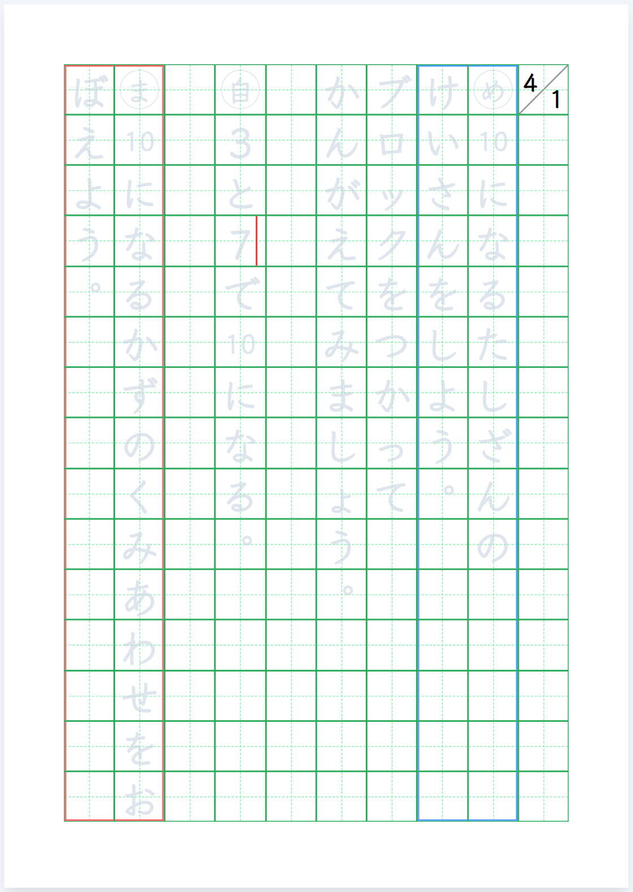

文字がうすくなり、なぞれる形になります。

### 穴埋め用（漢字・カナ空欄）に切り替える

「穴埋め用 (漢字・カナ空欄)」を選ぶと、漢字とカタカナだけが空欄になり、ひらがなと句読点はそのまま残ります。書き取りの小テストや、めあての穴埋めに使えます。

どの字が消えるかは、字の種類だけで決まります。学年による選び分けはしていないので、刷る前にプレビューで確かめてください。

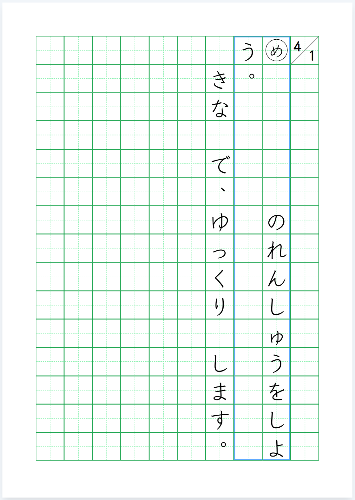

漢字とカタカナだけが空欄になります。

### 学年を選んで、書き写す時間の目安を見る

同じ画面の「学習時間の予測設定」で学年を選ぶと、プレビューの上に出る時間がその学年のものに変わります。1 分あたりに書ける文字数は、1 年が 10 文字、2 年が 15 文字、3 年が 20 文字、4 年が 25 文字、5 年が 30 文字、6 年が 35 文字として計算しています。

数えているのは、記号と空白を除いた文字数です。授業の時間配分を決めるときの目安にしてください。

## 行またぎで語が切れていないかを「警告」で確かめる

プレビューの右上に「警告: 0 件」と出ています。これは、行のおわりと次の行のはじめで、熟語やカタカナのことばが二つに割れていないかを自動で見つけたものです。0 件なら緑、1 件以上なら赤になります。

### 分かれてしまった場所を調べる

赤くなっている「警告」を押すと、どのページの何行目で分かれているかの一覧が出ます。「P.1 の 1〜2行目: 漢字の単語が分断されている可能性があります（「発」と「表」）」のように、割れた 2 文字も添えて出ます。

一覧を閉じるときは、一覧の外側をクリックしてください。

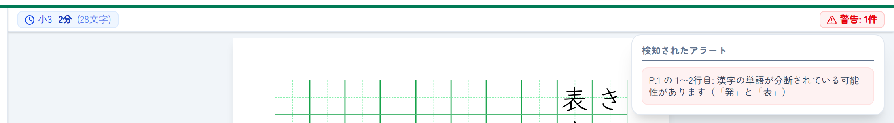

割れている行と、その 2 文字が出ます。

### 分かれてしまった場所を直す

直しかたは 2 つあります。文章のほうを打ちかえて折り返す場所をずらすか、「1行のマス数」を 1 つ増やしたり減らしたりして、割れないところまで動かしてください。

【！】覚えておいていただきたいこと:

- 見ているのは、漢字どうし、カタカナどうしが行をまたいだ場合だけです。ひらがなの語が割れても数えません。
- 直さなくてよい場合もあります。そこで切れても読める語なら、そのままで問題ありません。
- 数が 0 件でも、読みやすさまでは見ていません。刷る前に、プレビューを目で確かめてください。

### カタカナのことばが分かれた場合

カタカナも、漢字と同じように見ています。「ブロック」が「ブロ」と「ック」に分かれたようなときに数えられ、一覧には「カタカナの単語が分断されている可能性があります」と出ます。

低学年の見本では、カタカナが行をまたぐと読みにくくなります。数が出たら、いちど確かめてください。

0 件のときは緑色になり、押しても何も出ません。見るものが無いためです。1 件以上あるときだけ赤くなり、押せるようになります。

色だけでも判断できるので、刷る前にここが緑かどうかを見る習慣にしておくと早く済みます。

## 印刷する・PDF にする・画像で保存する

作った見本を紙にする方法と、画像のファイルにする方法があります。使いどころが違うので、両方を覚えておくと便利です。

### A4 で印刷する、PDF にする

左下の「印刷・PDF」を押すか、キーボードの Ctrl と P を同時に押してください。ブラウザの印刷画面が開きます。プリンタを選べば紙になり、送り先に「PDF に保存」を選べばファイルになります。

紙の向きは、選んだテンプレートから自動で決まります。国語のテンプレートは A4 のたて、算数のテンプレートと原稿用紙は A4 のよこです。

### 画像（PNG）で保存する

「画像保存」を押すか、キーボードの Ctrl と E を同時に押すと、見本が画像のファイルとして手元に落ちてきます。大型テレビに映したり、学級通信に貼りつけたりするときに使ってください。

画像になるのは 1 ページ目だけです。2 ページ目から先も画像でほしいときは、いったん PDF にしてから、そちらを画像にしてください。

### 2 ページ以上になったとき

文章が 1 枚に入りきらないと、続きは自動で 2 枚目、3 枚目になります。プレビューでは横に並び、縦書きのときは 1 ページ目が右、2 ページ目が左に置かれます。

見えていないページを見るには、プレビューの上でマウスのホイールを回すか、キーボードの Alt と左右の矢印を押してください。印刷すると、並んでいる全部のページが刷られます。

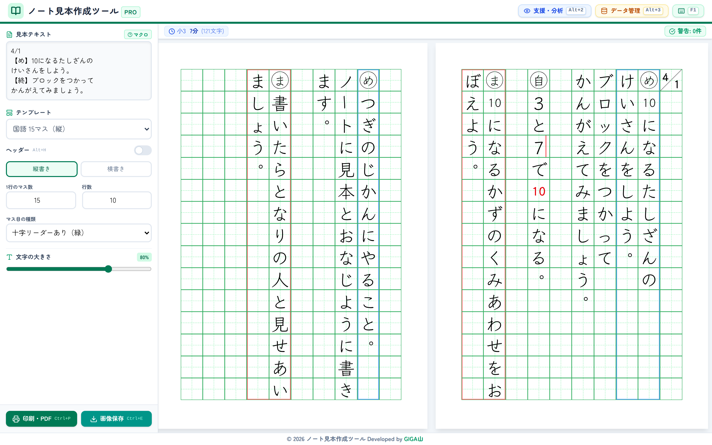

縦書きでは、右が 1 ページ目です。

【！】覚えておいていただきたいこと:

- プレビューに出ているものが、そのまま刷り上がりです。刷ってから直すより、ここで直すほうが速く済みます。
- 何ページになるかは、プレビューに並んだ紙の枚数で分かります。刷る前に数えてください。
- 最後の行が切れていないか、いちばん左（横書きでは いちばん下）の列を見てください。
- マス目の線は色で刷られます。白黒のプリンタでは灰色になりますが、見本としては使えます。

## 作った見本に名前を付けて保存し、呼び出す（データ管理）

よく使う見本は、名前を付けて残しておけます。保存されるのは、文章だけでなく、テンプレート、マス数、文字の大きさなど、そのときの設定ひとそろいです。

画面の右上にある「データ管理」を押すと開きます。キーボードの Alt と 3 でも開きます。

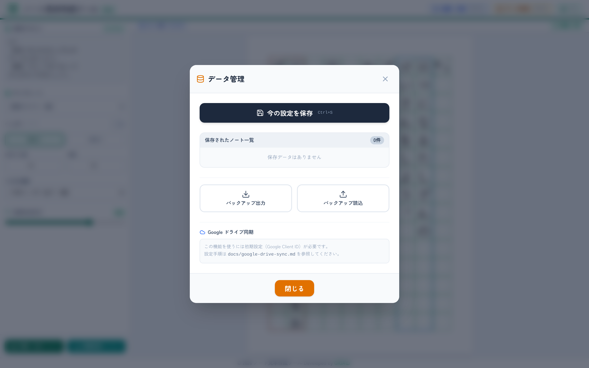

上が保存、下がバックアップの出し入れです。

### 今の設定に名前を付けて保存する

保存の手順:

1. 「データ管理」を開いてください。
2. いちばん上の「今の設定を保存」を押してください。名前を聞かれます。
3. 分かりやすい名前を入れて、決定を押してください（例:「3年_たしざんの見本」）。
4. 「保存されたノート一覧」に増えていれば、保存できています。

キーボードの Ctrl と S を同時に押しても、同じように名前を聞かれます。この場合は「データ管理」を開かなくてもかまいません。

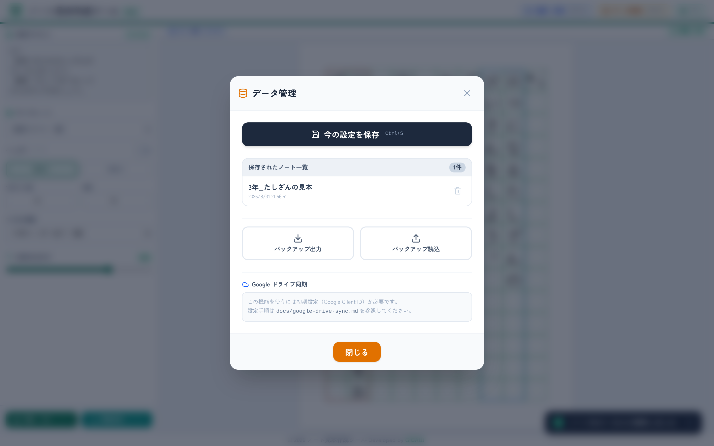

保存したものは、この一覧に並びます。

### 保存したノートを呼び出す、消す

一覧の名前を押すと、そのノートを呼び出せます。押すと「現在の編集内容は失われます。読み込みますか？」と確かめられるので、いまの文章を残したい場合は、先に保存しておいてください。

消すときは、名前の右にあるごみ箱の絵を押します。ここでも一度確かめられます。

【！】覚えておいていただきたいこと:

- 保存したものは、そのパソコンの中だけに残ります。別のパソコンには出てきません。
- ブラウザの「閲覧履歴の削除」で「サイトのデータ」も一緒に消すと、保存したノートも消えます。
- 大事なものは、次の章のバックアップを取っておいてください。

## 別の端末でも同じ見本を使う（バックアップと Google ドライブ同期）

職員室のパソコンと教室のタブレットで同じ見本を使いたいときの方法です。ファイルで持っていく方法と、Google ドライブでそろえる方法の 2 つがあります。

どちらも「データ管理」の中にあります。先に、残したい見本を名前を付けて保存しておいてください。

### ファイルに書き出して持っていく

バックアップの手順:

1. 「データ管理」を開き、「バックアップ出力」を押してください。ファイルが 1 つ手元に落ちてきます。
2. そのファイルを、USB メモリや校内の共有フォルダで別のパソコンへ運んでください。
3. 別のパソコンで同じアプリを開き、「データ管理」の「バックアップ読込」を押して、そのファイルを選んでください。

読みこんだノートは、いまあるノートに足されます。同じものが二重に並ぶことはありません。

### Google ドライブと同期する

「データ管理」のいちばん下に「Google ドライブ同期」があります。「Google でログインして同期」を押し、お使いの Google アカウントでログインすると、保存したノートが自動でドライブにバックアップされ、別の端末でも同じアカウントでログインするだけで出てきます。

ログインのときに、アプリがドライブを使ってよいかを確かめる画面が出ます。これは、このアプリが自分の作ったバックアップファイルを読み書きするための許可を求めるもので、先生のほかの書類には仕組みのうえで触れられません。安全ですので、そのまま進めてください。

つないだあとは、「今すぐ同期」で手で合わせることも、「保存時に自動でバックアップ」を入り切りすることもできます。やめるときは「連携解除」を押してください。

同期されるのは、名前を付けて保存したノートだけです。編集中の文章は同期されません。

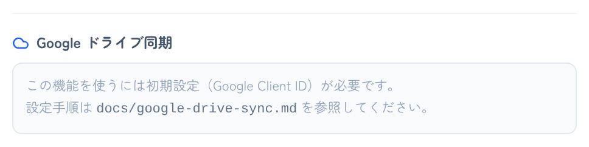

この表示のときは、同期の機能は使えません。

### 【！！】消したノートが復活することについて

このバックアップは、取りこぼしを防ぐために、どちらか一方にしか無いノートを必ず残す作りになっています。そのため、片方の端末で消しただけでは、次に同期したときにもう一方から戻ってきます。

完全に消したいときは、つないでいる端末すべてで同じノートを消してから、もう一度同期してください。この順番を守らないと、消したつもりのものが残り続けます。

## タブレットやスマートフォンで使う（アプリとして入れる）

同じアドレスを開くだけで、タブレットでもスマートフォンでも使えます。画面が狭いときは、左の設定欄がかくれた形で立ち上がります。

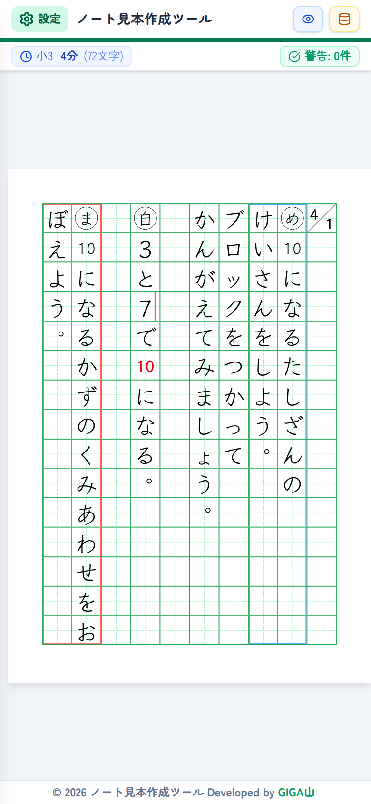

設定欄はかくれ、見本だけが出ます。

### 狭い画面で設定欄を開く

画面の左上にある「設定」を押すと、設定欄が横から出てきます。閉じるときは、右上のばつ印を押すか、設定欄の外側の暗いところを押すか、キーボードをつないでいれば Esc を押してください。

設定の中身は、パソコンで開いたときと同じです。

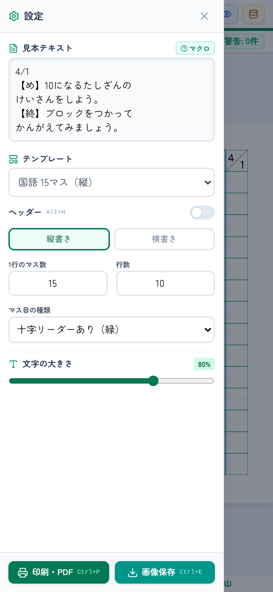

「設定」を押すと、横から出てきます。

### ホーム画面に追加して、つながっていなくても使う

このアプリは、端末に入れてアプリのように使えます。ブラウザのメニューから「ホーム画面に追加」を選んでください。一度入れておくと、次からはアイコンを押すだけで開き、インターネットにつながっていない場所でも使えます。

保存したノートは端末の中にあるので、つながっていなくても呼び出せます。Google ドライブとの同期だけは、つながっているときに行われます。

### 指で操作するときに気をつけること

プレビューをなぞって装飾する操作は、マウスを前提にしています。指では選びにくいので、タブレットでは記号を打つほうが確実です。記号は「マクロ」の一覧から確かめられます。

2 ページ以上あるときは、プレビューを指で左右にはらうと送れます。キーボードをつないでいれば、Alt と左右の矢印も使えます。

タブレットから刷るときも、手順はパソコンと同じです。「印刷・PDF」を押すと、端末の印刷画面が開きます。

## キーボードだけで操作する（ショートカット一覧）

よく使う操作は、キーボードからも呼び出せます。画面の右上にあるキーボードの絵のボタン、またはキーボードの F1 を押すと、一覧がいつでも出ます。

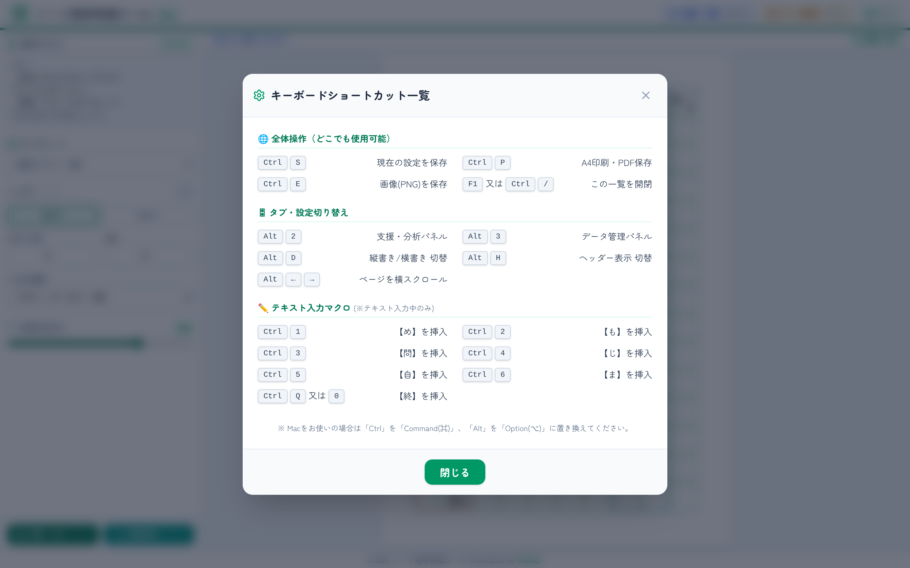

F1 を押すと、いつでもこの一覧が出ます。

### どこでも使えるキー

1. Ctrl と S…　今の設定に名前を付けて保存します。
2. Ctrl と P…　印刷、または PDF にします。
3. Ctrl と E…　画像（PNG）で保存します。
4. F1、または Ctrl と /…　ショートカットの一覧を開いたり閉じたりします。
5. Alt と 2…　支援・分析を開きます。
6. Alt と 3…　データ管理を開きます。
7. Alt と D…　縦書きと横書きを切り替えます。
8. Alt と H…　ヘッダーを出したり消したりします。
9. Alt と左右の矢印…　プレビューを横に送ります。2 ページ以上あるときに使います。
10. Esc…　開いている画面や、狭い画面の設定欄を閉じます。

Mac をお使いの場合は、Ctrl を Command（⌘）に、Alt を Option（⌥）に読みかえてください。

### 文章を打っているときだけ使えるキー

次のキーは、左の入力欄にカーソルがあるときだけはたらきます。カーソルのあるところに記号が入ります。

1. Ctrl と 1…　【め】が入ります。
2. Ctrl と 2…　【も】が入ります。
3. Ctrl と 3…　【問】が入ります。
4. Ctrl と 4…　【じ】が入ります。
5. Ctrl と 5…　【自】が入ります。
6. Ctrl と 6…　【ま】が入ります。
7. Ctrl と 0、または Ctrl と Q…　【終】が入ります。

何も入らないときは、入力欄を一度クリックしてからお試しください。

## うまくいかないときの対処（症状別）

起きやすいものを、症状ごとに並べています。上から順に読む必要はありません。

### 印刷したら、マスの線や色が出ない場合

いちばん多いのがこれです。ブラウザの印刷設定で、背景の絵を刷らない指定になっています。

Chrome と Edge では、印刷画面の「詳細設定」を開き、「背景のグラフィック」にチェックを入れてください。Safari では「背景をプリント」にチェックを入れてください。

### 印刷したら、はみ出す・2 枚に分かれる場合

上から順に確かめてください。

1. 印刷画面の「用紙サイズ」が A4 になっているか。
2. 紙の向きが合っているか。算数のテンプレートと原稿用紙は A4 のよこです。
3. 「倍率」が「用紙に合わせる」になっているか。
4. それでも収まらなければ、左の「文字の大きさ」を少し小さくしてください。

### 文字がマスからずれる・ぎゅうぎゅうになる場合

「1行のマス数」が、お使いのノートと合っていません。ノートの 1 行のマスを実際に数えて、同じ数を入れてください。

それでも詰まって見えるときは、「文字の大きさ」を下げると余白ができます。

### 打った記号が見本に出てこない場合

記号のかっこが全角の【 】になっているか確かめてください。半角の [ ] や、ふつうのかっこでは記号として読まれず、そのまま文字として出ます。

中の文字も、一覧と同じものかを見てください。「マクロ」を押すと、使える記号がそのまま出ます。

### マス数や向きを変えられない場合

テンプレートに「原稿用紙 400字」を選んでいないか確かめてください。原稿用紙のあいだは、マス数、行数、向き、マス目の種類、ヘッダーが決まっているので変えられません。

ほかのテンプレートに切り替えると、また変えられるようになります。

### 画面が白いまま・動かなくなった場合

いったんページを閉じて、もう一度開いてください。それでも直らなければ、キーボードの Ctrl を押しながら F5 を押すと、読み込み直します。

この操作をしても、保存したノートは消えません。

### 保存したノートが見あたらない場合

別のパソコンで作ったものは、そのままでは出てきません。「別の端末でも同じ見本を使う」の章のやり方で持ってきてください。

ブラウザの「閲覧履歴の削除」で「サイトのデータ」も一緒に消した場合は、残念ながら戻せません。大事なものは、ふだんからバックアップを取っておいてください。

### それでも解決しない場合

まず、このアプリを教えてくれた先生や、校内の情報担当の先生にご相談ください。同じ端末を使っている学校では、すでに同じことを解いていることがあります。

校内で分からなければ、このページのいちばん下にある問い合わせ先からお知らせください。

## 子どもの情報と、共用の端末についてのお願い

このアプリは、子どもの情報をひとつも受け取らない作りにしています。そのうえで、使う先生の側でも気をつけていただきたいことが 2 つあります。

### 子どもの名前や個人情報は入れない

見本の文章に、子どもの名前、出席番号、学級名を入れないでください。ノートの見本を作るのに、それらは必要ありません。

ヘッダーの「なまえ」は、子どもが手で書くための空欄です。ここに名前を打ちこむ機能はありません。

### 共用の端末では、使い終わったら消す

打った文章と保存したノートは、そのパソコンの中に残ります。職員室の共用のパソコンでは、あとから使う先生にも見えます。

気になる場合は、席を立つ前に「データ管理」から保存したノートを消し、入力欄の文章も消しておいてください。Google ドライブとつないだ端末では、「連携解除」も押しておくと安心です。

打った文章と、名前を付けて保存したノートは、その端末のブラウザの中だけに残ります。Google ドライブ同期を使わないかぎり、どこへも送られません。

残っているものを消す方法は 2 つあります。「データ管理」から 1 つずつ消す方法と、ブラウザの「閲覧履歴の削除」で「サイトのデータ」ごと消す方法です。後者はすべて消え、元に戻せません。

学校の端末を年度末に返すときや、貸し出し用の端末を次の先生へ渡すときは、後者で消しておくと確実です。
