# 教室で使えるかもしれないもの作り #◯ 「マスの数、また数えるんですか」打った文章がそのまま見本になるアプリ「ノート見本作成ツール PRO」

## 🏫 はじめに

明日の授業で使うノートの見本を、黒板の前でマスを数えながら書いたことはありませんか。

一行が十五マスなのか十二マスなのか。子どもたちのノートを一冊借りてきて、実際に数えて、それに合わせて黒板に線を引く。書いているうちに一行はみ出したことに気づいて、消して書き直す。そのあいだにチャイムが鳴る。低学年をもったことのある先生なら、一度は通った道だと思います。

見本づくりそのものは、五分か十分の仕事です。けれど、その五分は毎日やってきます。国語で一枚、算数で一枚、翌日にはまた別の単元で一枚。積み上げると、けっこうな時間になります。しかもその時間は、子どもたちがいない時間、つまり本当は教材研究や子どもの作品を読む時間に使えたはずのものです。

そこで作ったのが「ノート見本作成ツール PRO」です。左の入力欄に、ノートに書かせたい文章をそのまま打ちこむだけ。右側にマス目に割り付けられた見本ができあがり、そのまま A4 に印刷できます。

https://notebooksample-generator.giga-school.com/

インストールはいりません。学校のタブレットでも職員室のパソコンでも、このアドレスを開けばすぐに使えます。子どもの名前や成績を入れる欄はひとつもありません。入力するのは、先生が黒板に書こうとしていた文章だけです。

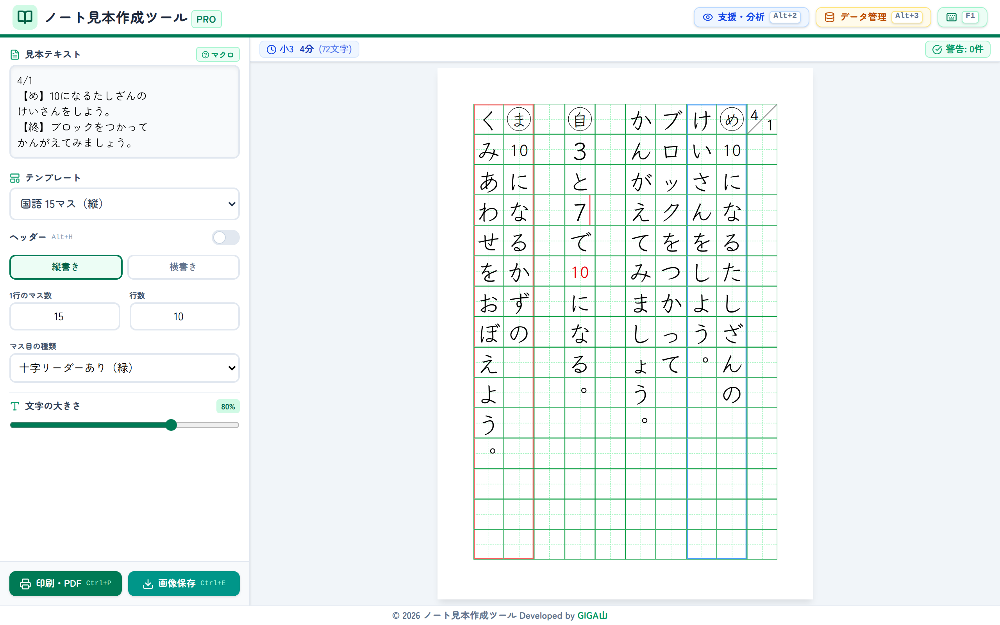

開いた直後の画面です。左が入力欄と設定、右が印刷される見本そのものです。

## 📱 このアプリでできること

いちばん伝えたいのは、マスの数を自分で数えなくてよくなる、ということです。

左上の入力欄に文章を打つと、右の見本がその場で組み上がります。改行したところで行が変わり、一行に入りきらない文章は自動で次の行へ送られます。句読点や閉じかっこが行のはじめに来そうになったときは、前の行の最後のマスへ送り返します。国語で「行頭に句点を置かない」と教えている先生なら、この処理が入っていることの意味はすぐに分かっていただけると思います。

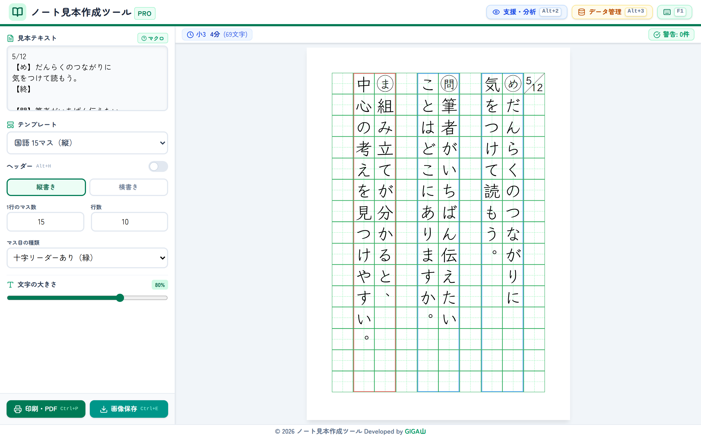

打った文章が、そのままマス目に割り付けられていきます。

細かいところですが、算数で助かるはずの仕掛けも入れてあります。文章の先頭に 4/1 のように打つと、斜線の入った日付のマスになります。日付を一マスに収めたいという、ノート指導では当たり前なのに手書きだと面倒な処理です。それから、12 や 345 のような二桁以上の半角数字は、ひとマスにまとめて表示します。算数のノートで数字を一文字ずつマスに割るとかえって読みにくくなりますので、そこは算数のノートの流儀に合わせました。

用紙は、上から二つ目の「テンプレート」で選びます。国語の十五マス、国語の十二マス、算数の十七マス、算数の二十二マス、それに原稿用紙の四百字。この五つです。選ぶとマスの数も行数も、縦書きか横書きかも、紙の縦横も、まとめて切りかわります。算数のテンプレートを選べば、用紙は自動で A4 の横になります。この「紙の向きが勝手に決まる」ところは、印刷でつまずかないようにするために、あえて先生に選ばせない作りにしました。

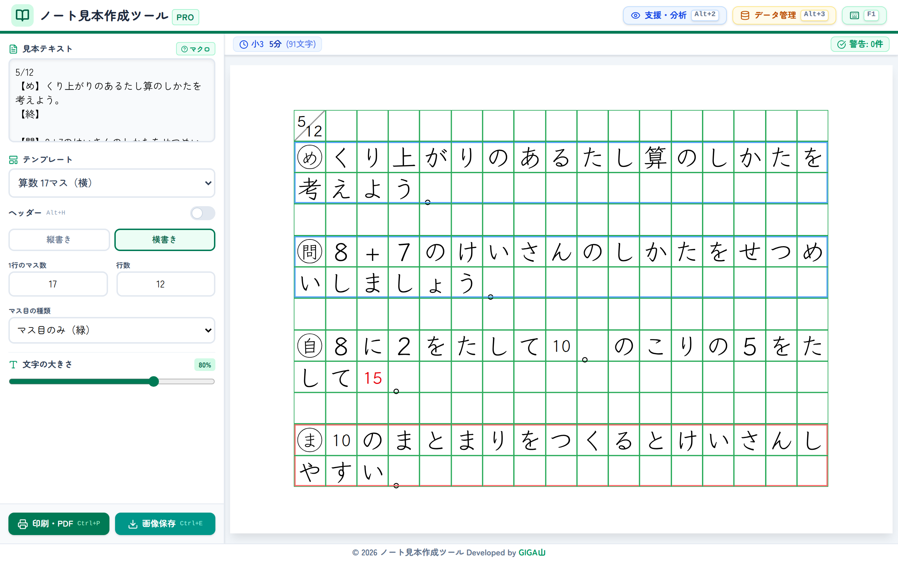

算数を選ぶと横書きになり、紙も A4 の横に変わります。

もちろん、お使いのノートがこの五つに当てはまらないこともあります。そのときは一行のマス数を五から三十まで、行数を三から二十五まで、自由に決められます。数を変えると、テンプレートの表示は自動で「カスタム設定」に切りかわります。

マス目そのものの見た目も三種類から選べます。十字リーダーの入った緑のマス、リーダーなしのマスだけのもの、それから枠線のない白紙です。白紙を選ぶと、文章の配置だけがそのまま残ります。学級通信に貼る文例を作りたいときや、清書の手本を出したいときに使えるようにと思って入れました。

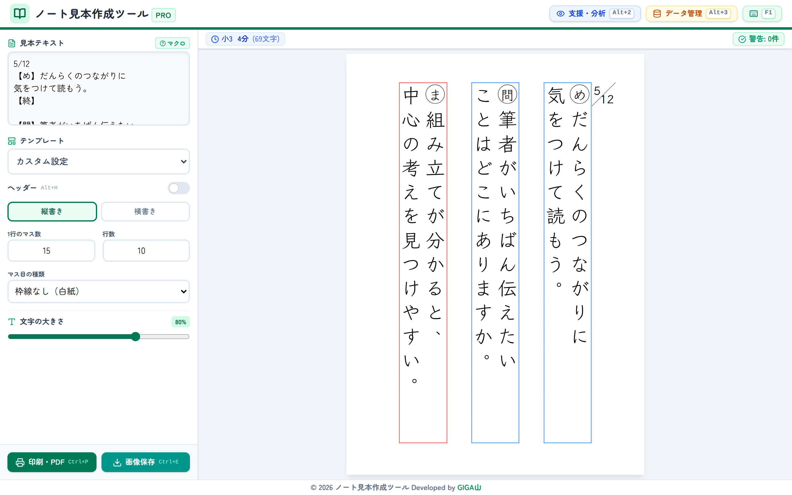

同じ文章でも、マス目を消すとずいぶん印象が変わります。

紙の上に「月」「日」「題名」「なまえ」の記入欄を出すかどうかも、ひとつのスイッチで切りかえられます。学年や場面によって、ここは要る要らないが分かれるところだと思います。

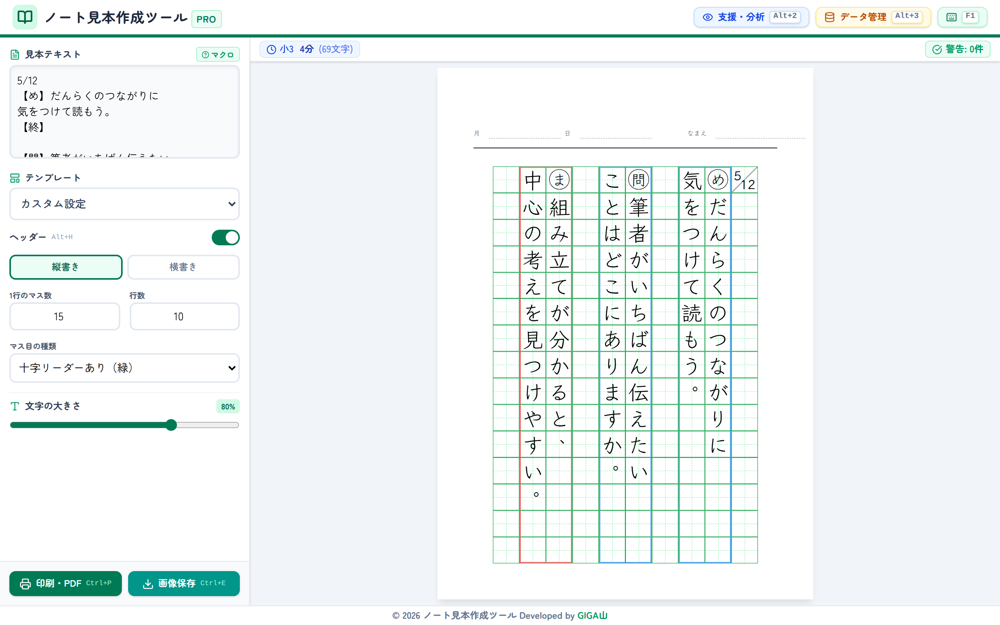

ヘッダーを出すと、上に記入欄がつきます。

文章が一枚に収まらないときは、自動で二枚目、三枚目と続きます。枚数の上限はありません。印刷すると、その全部が出ます。

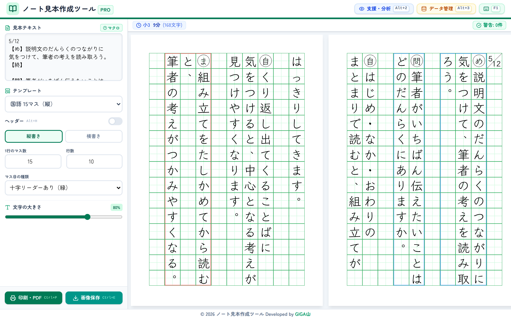

一枚に入りきらない文章は、そのまま次の紙へ続きます。

作文や清書のための原稿用紙も、テンプレートのひとつとして用意しています。二十マス二十行の四百字詰めで、中央には折り目の印も入っています。

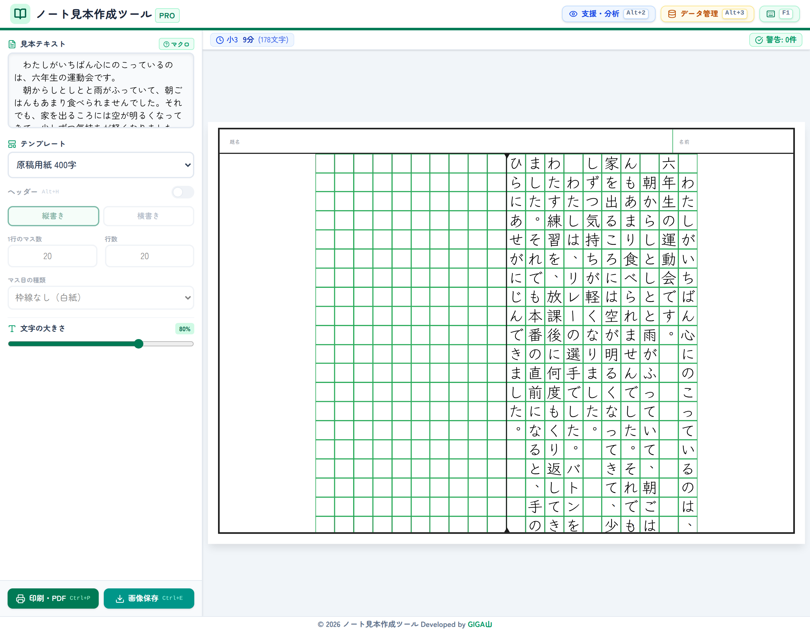

原稿用紙を選んだときだけは、マスの数や向きが固定されます。変えられるのは文字の大きさだけです。

## ✍️ 記号を覚えなくていい。なぞって飾りをつける

ここからが、このアプリでいちばん時間をかけたところです。

ノートの見本は、ただ文章が並んでいるだけでは見本になりません。めあてには丸で囲んだ「め」がついて、その下が青い枠で囲まれている。まとめは赤い枠。大事なことばには赤い線が引いてある。数字は四角で囲む。そういう約束ごとがあって、はじめて子どもたちが真似できる形になります。

この飾りは、文章の中に記号を打つことで指定します。【め】と打てば丸囲みの「め」になり、そこから下が青い枠で囲まれます。【ま】なら赤い枠。【赤線】と【線終】ではさんだところには赤い線が引かれます。【穴】と【穴終】ではさめば点線の空欄になり、【枠】と【枠終】なら太い黒枠で囲まれます。かこみの記号が七つ、線と色と枠の記号があわせて十八、それに三角と四角と丸の図形が三つ。全部で二十八の記号が使えます。

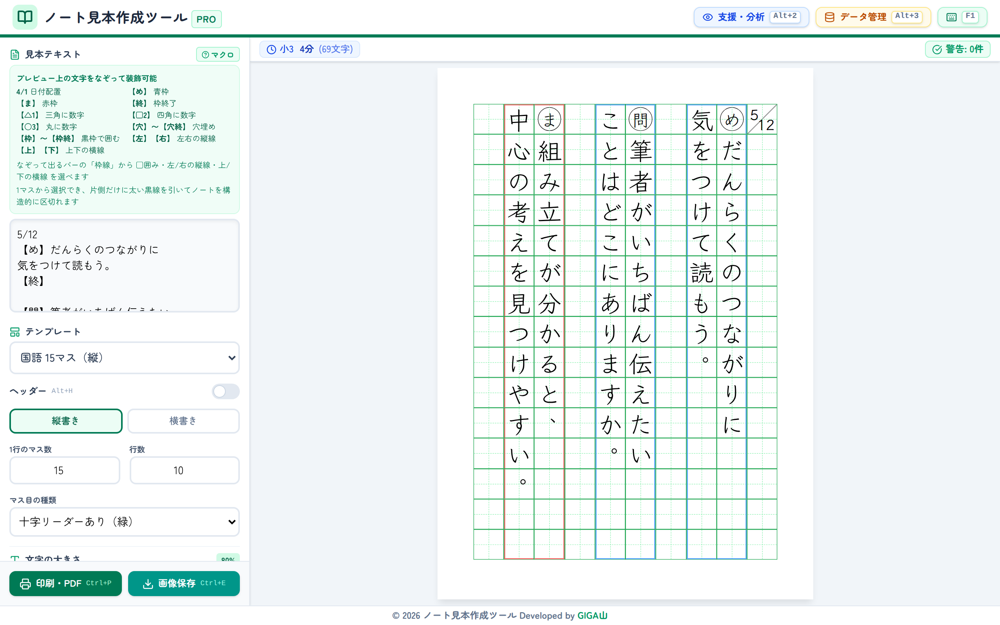

入力欄の右上にある「マクロ」を押すと、記号の早見表が出ます。

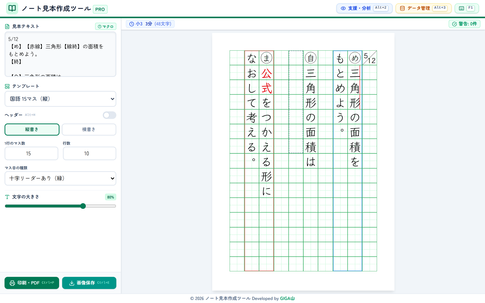

赤い線、赤い字、点線の空欄。どれも文章の中の記号で指定しています。

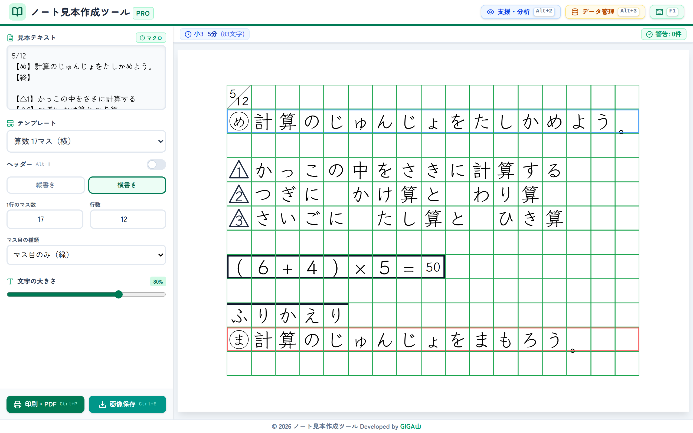

三角の中に数字を入れて手順を示したり、式のまわりを太い枠で囲んだり、ノートを区切る線を引いたりもできます。

ただ、正直なところ、この二十八個を覚えて使ってくださいというのは無理だと思いました。私自身、自分で作ったのに時々どれがどれだか分からなくなります。

そこで入れたのが、なぞって飾る仕組みです。右側の見本の上で、飾りたい文字をマウスでなぞってください。選んだところが緑色になり、下にボタンの並んだバーが出てきます。

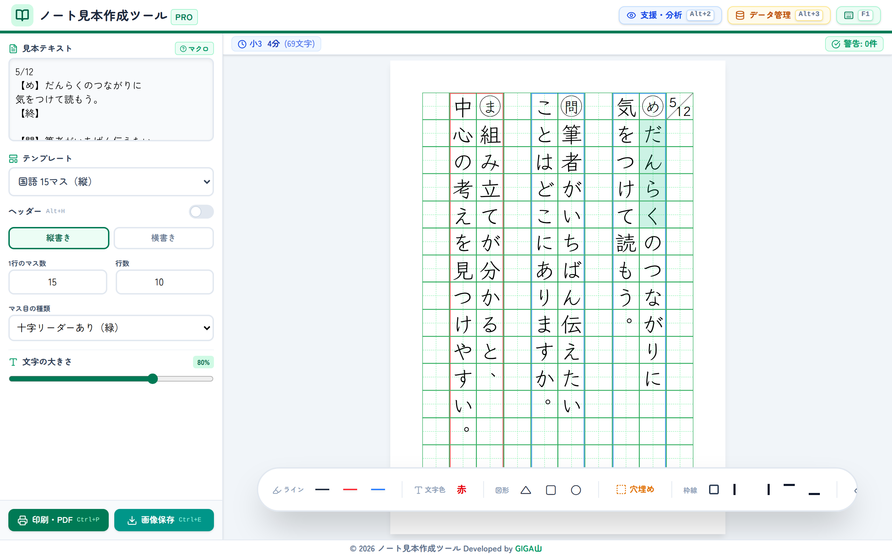

「だんらく」の四文字をなぞったところです。下に出たバーから、線、赤字、図形、穴埋め、枠線が選べます。

このバーから「穴埋め」を押すと、なぞったところが点線の空欄に変わります。そして同時に、左の入力欄にも【穴】と【穴終】が自動で書きこまれます。

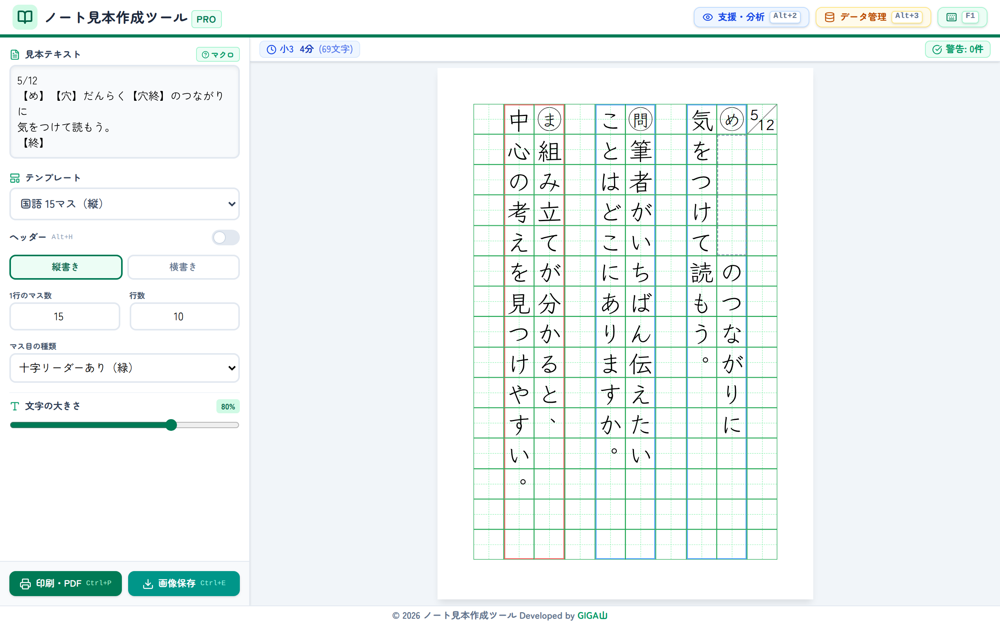

なぞって押すだけで、記号のほうが勝手に入ってくれます。

つまり、記号を一つも覚えなくても、思いどおりの見本が作れます。そして入力欄を見れば「ああ、こう書けばいいのか」と後から分かるようになっています。覚えたい先生は覚えられるし、覚えたくない先生は覚えなくていい。どちらの先生も置いていかないように、と考えた結果です。

慣れてきた先生のために、キーボードだけで記号を入れる道も用意しました。入力欄に文字を打っているときに Ctrl キーを押しながら数字を押すと、よく使う七つの記号が入ります。

## 🧒 書くのがしんどい子に合わせる

見本ができても、それを二十分で写せる子と、四十分かかっても写しきれない子がいます。

画面右上の「支援・分析」を押すと、三つの表示から選べます。ふつうの見本、なぞり書き用の薄い文字、それから漢字とカタカナだけが空欄になった穴埋め用です。同じ文章のまま、その子に合う一枚だけを差し替えて印刷できます。

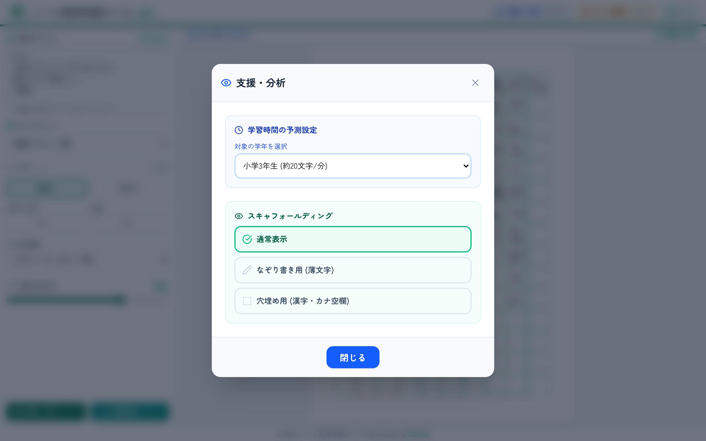

学年と表示のしかたを、ここでまとめて選びます。

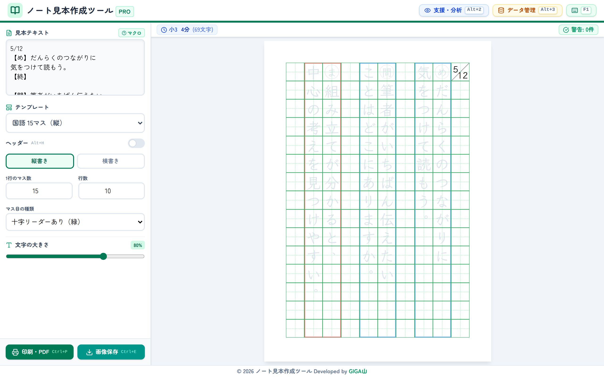

なぞり書き用にすると、文字が薄くなります。上からなぞらせる一枚です。

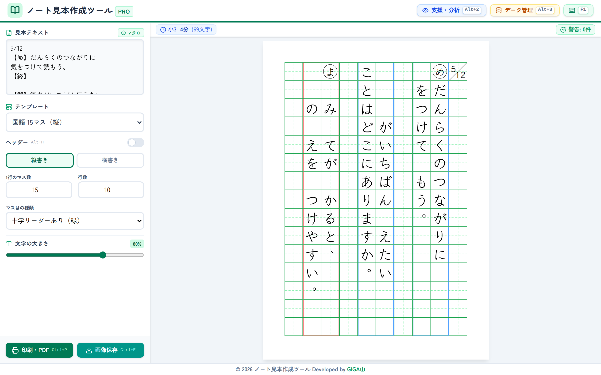

穴埋め用では、漢字とカタカナだけが空欄になります。書き取りの練習にそのまま使えます。

同じ画面で学年を選ぶと、画面の上に「小3 4分（69文字）」のような表示が出ます。その学年の子が、この文章を書き写すのにだいたい何分かかるかの目安です。一年生を毎分十文字、二年生を十五文字と置いて、六年生の毎分三十五文字まで、学年ごとの書字速度から計算しています。

この数字は、あくまで机の上の計算です。実際の教室ではもっとかかると思います。それでも「今日の見本は九分か。導入を短くしよう」と考える材料にはなるはずです。書かせすぎて時間が足りなくなる、というのは誰にでも起きることなので、印刷する前に数字が目に入るところに置きました。

もうひとつ、画面の右上に「警告」という表示があります。これは、行のおわりと次の行のはじめで、漢字の熟語やカタカナのことばがまっ二つに分かれていないかを見ています。押すと、何ページの何行目かが一覧で出ます。

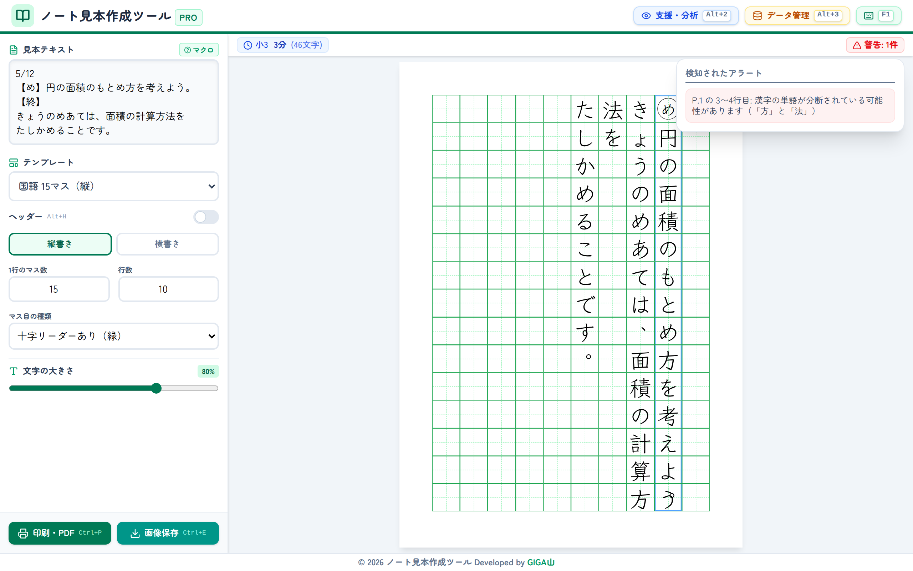

「計算方法」が「方」と「法」で分かれてしまっていることを知らせています。

ここで切れても構わないことばもありますから、警告が出たからといって必ず直す必要はありません。ただ、低学年の子は行をまたいだ熟語をうまく読めないことがあります。印刷して配ってから気づくより、画面の上で気づけたほうがいい、というだけのものです。

## ✨ 導入のメリット

三つのいいことが期待できます。

一つ目は、放課後の準備が短くなることです。マスを数える、下書きをする、書き直す。この三つが、文章を打つだけになります。一度作った見本は名前をつけて保存できるので、来年また同じ単元を教えるときには呼び出すだけです。同じ単元を毎年教える小学校の仕事とは、相性がいいと思っています。

二つ目は、黒板に書く時間そのものが要らなくなることです。印刷して配ってもいいですし、画像として保存して大型テレビに映してもかまいません。板書のあいだ、先生は子どもたちに背中を向けることになります。その時間がなくなるぶん、子どもたちのほうを見ていられます。

三つ目は、書くのがしんどい子に、その子用の一枚をすぐ出せることです。なぞり書きの一枚を作るために、いつもの見本をもう一度手で書き直す必要はありません。表示を切りかえて、もう一度印刷を押すだけです。手間が減れば、その子のための一枚を用意するハードルも下がります。そうなればいいと思って作りました。

## 🛠️ 【管理者向け】導入手順

情報担当の先生に確認されそうなことを、先に書いておきます。

このツールにはサーバーがありません。配信元の GitHub Pages は、完成したファイルを配るだけです。先生が打った文章がどこかに送られたり、記録されたりすることはありません。子どもの氏名や学籍番号、成績を入力する欄も存在しません。アクセス解析や広告の類も入れていません。

作ったノートは、使っている端末のブラウザの中だけに保存されます。同じブラウザを使う人には見えますので、共用のパソコンをお使いの場合は、席を立つ前に「データ管理」から消していただくのが安全です。ブラウザの「閲覧履歴・サイトデータの削除」を実行すると、保存したノートも一緒に消えます。大切なものは「データ管理」の「バックアップ出力」でファイルに書き出しておいてください。

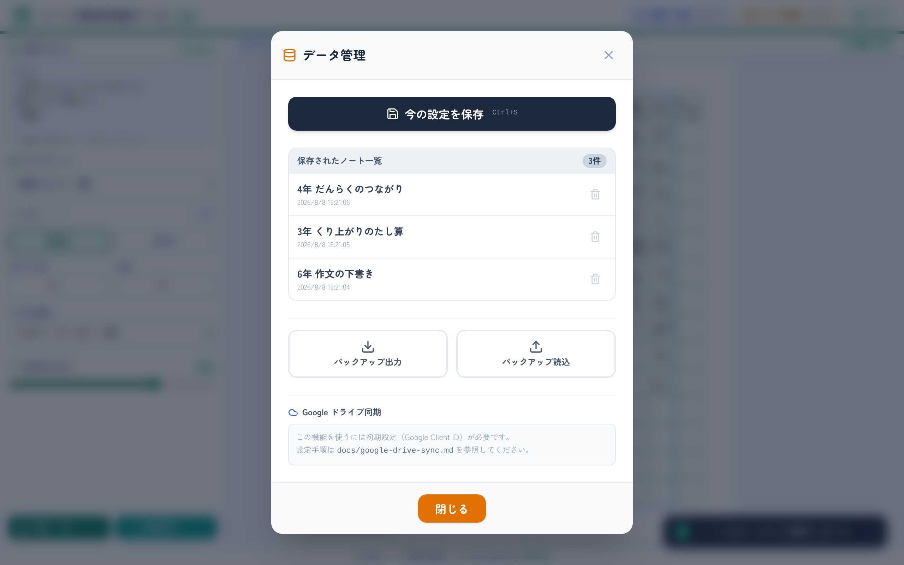

保存したノートの一覧と、バックアップの出し入れがここにまとまっています。

校内のフィルタリングで許可が必要なアドレスは、次の四つです。

1. fonts.googleapis.com（本文の書体を取ってくる先）
2. fonts.gstatic.com（同上）
3. accounts.google.com（Google ドライブ同期を使うときだけ）
4. www.googleapis.com（同上）

上の二つは、初回に表示するときだけ使います。二回目以降は端末の中に残ったものを使いますので、通信は発生しません。下の二つは、あとで説明する Google ドライブ同期を使う場合にだけ必要です。同期を使わないのであれば、上の二つだけ通してもらえれば全部の機能が動きます。この四つ以外への通信は、アプリ側の設定で禁止しています。

ホーム画面に追加すると、アプリのように起動して、インターネットにつながっていなくても使えます。校内の通信が不安定な学校や、持ち帰り端末で使いたい場合は、この形をおすすめします。

職員室のパソコンと教室のタブレットで同じノートを使いたい場合は、二つの方法があります。かんたんなのは「バックアップ出力」でファイルを書き出し、もう一方の端末で「バックアップ読込」から戻す方法です。読みこんだノートは今あるものに追加され、同じノートが二重になることはありません。

もうひとつが Google ドライブ同期です。こちらは学校で一度だけ設定していただく必要があります。アプリが要求する権限は、このアプリ自身が作ったファイルだけを読み書きするものに限っていますので、先生の他のドライブの書類には、しくみのうえでさわれません。設定がまだの状態では、データ管理の画面に「初期設定が必要です」と表示されます。設定のしかたはリポジトリの docs フォルダに置いてあります。

ひとつだけ注意していただきたいのが、削除は自動で同期されないことです。取りこぼしを防ぐために、両方に残っているものを足し合わせる作りにしています。片方で消しても、もう片方に残っていれば復活します。完全に消したいときは、両方の端末で消してください。

保存できるノートの数にも、いちおう上限があります。ブラウザが一つのサイトに割りあてる保存領域は五メガバイトほどで、ノートを大量にためこむと保存に失敗することがあります。失敗しても今までのデータが壊れることはありませんが、学年が上がったタイミングで古いものを整理していただくのがよいと思います。

印刷については、三つだけ。用紙は A4 の縦と横を前提にしています。印刷の設定画面で「背景のグラフィック」に印をつけてください。マスの線や色が出ないという相談は、原因のほとんどがこれです。それから、画像として保存する機能は一ページ目だけを画像にします。二ページ目より先も画像で欲しいときは、いったん PDF にしてから画像に変換していただくことになります。

書体についても一言。ノートのマスの中は教科書体で出るようにしていますが、教科書体は端末に入っている場合だけ使われます。入っていない端末では別の書体になります。Windows の学習者用端末であればたいてい入っていますので、まずはそのまま使ってみてください。

## 📖 【利用者向け】使い方のガイド

はじめて開いた先生に向けて、最初の一枚ができるまでを書きます。

1. https://notebooksample-generator.giga-school.com/ を開きます。
2. 左上の入力欄に、すでに文章が入っています。それを消して、ノートに書かせたい文章を打ちます。
3. 左の「テンプレート」から、お使いのノートに近いものを選びます。国語の十五マス、算数の十七マスあたりが出発点になります。
4. 右側の見本を見て、マスの数が合っていなければ「1行のマス数」を実際のノートと同じ数に直します。
5. 文字がはみ出すようなら「文字の大きさ」のつまみを左に動かします。
6. 左下の「印刷・PDF」を押します。印刷の設定で「背景のグラフィック」に印をつけて、印刷します。

これで一枚できます。飾りをつけたくなったら、続けて次の手順です。

1. 右側の見本の上で、飾りたい文字をマウスでなぞります。
2. 下に出てきたバーから、線、赤字、図形、穴埋め、枠線のどれかを押します。
3. やめたいときは、なぞってから「クリア」を押します。
4. 選ぶのをやめたいときは、見本の外側の灰色のところをクリックします。

紙ではなく画面で見せたいときは、「印刷・PDF」の隣にある「画像保存」を押してください。一ページ目が画像として保存されます。大型テレビに映したり、学級通信に貼ったりするのはこちらが早いと思います。

作った見本を取っておきたいときは、右上の「データ管理」から「今の設定を保存」を押して、名前をつけます。同じ画面の一覧に並び、押すと呼び出せます。

キーボードで速く操作したい先生のために、ショートカットも用意しました。画面右上の F1 を押すと、いつでも一覧が出ます。

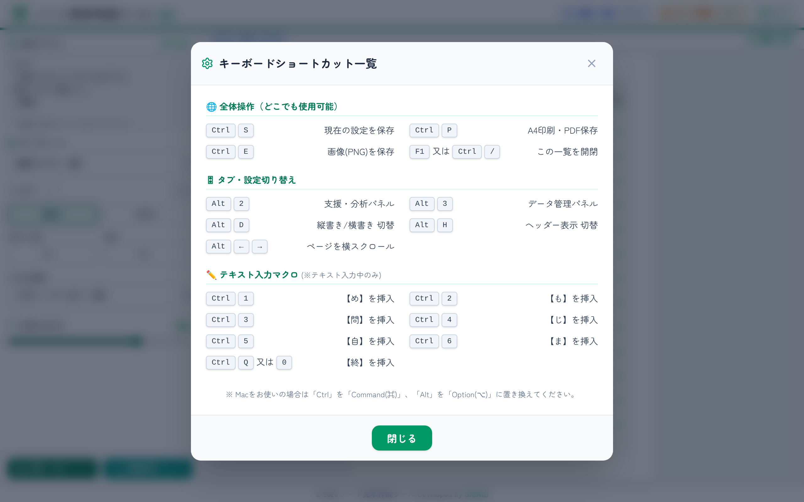

保存、印刷、画像保存、それに記号の入力まで、キーボードだけで進められます。

スマートフォンやタブレットでも同じように使えます。画面が狭いときは、左の設定欄が隠れています。左上の「設定」を押すと、横から出てきます。

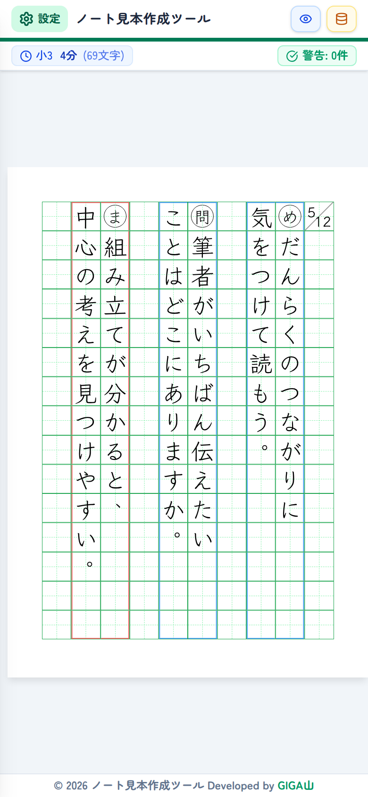

狭い画面では、見本が画面いっぱいに出ます。

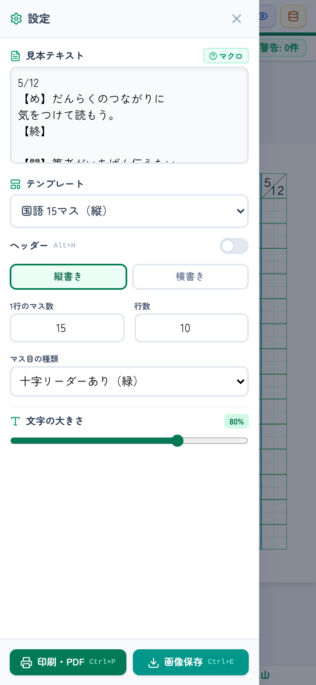

「設定」を押すと、入力欄と設定が横から出てきます。

最後にひとつ。うまくいかないときの原因でいちばん多いのは、記号のかっこが半角になっていることです。【 】は全角で打ってください。半角の角かっこでは記号として認識されません。打った記号がそのまま印刷されそうになっていたら、まずここを疑ってみてください。

## 📝 まとめ

このアプリは、授業をうまくするための道具ではありません。授業の準備にかかっていた時間を、少しだけ返すための道具です。

マスを数えて黒板に書き写す作業は、たしかに先生の仕事です。でも、その作業が上手になっても、子どもたちが読み取る力は伸びません。伸びるとしたら、その分の時間で先生が教材を読みこんだり、昨日提出されたノートに一言書いたり、休み時間に子どもの話を聞いたりしたときだと思います。

ICT を入れる目的は、効率化そのものではないはずです。機械にまかせられることを機械にまかせて、人にしかできないことに時間を回す。そのための道具のひとつとして、このアプリが使ってもらえたらうれしいです。

このツールは MIT ライセンスで公開しています。どの学校でも自由に使えますし、校内向けに文言を変えたり、学年に合わせてテンプレートを足したりしていただいて構いません。うまくいかないことや「こうだったらいいのに」があれば、ぜひ教えてください。

一歩踏み出そうとする先生を、私はいつでも全力で応援しています。
